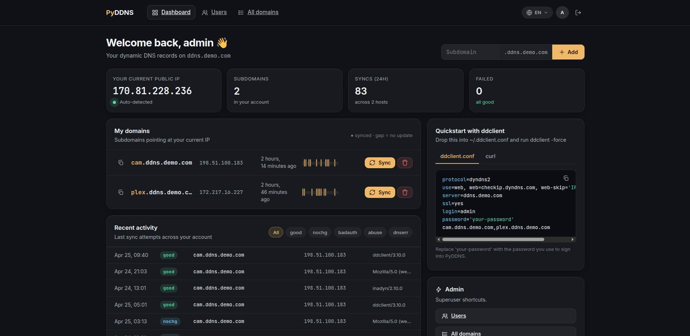
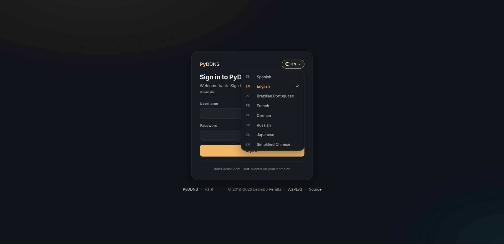
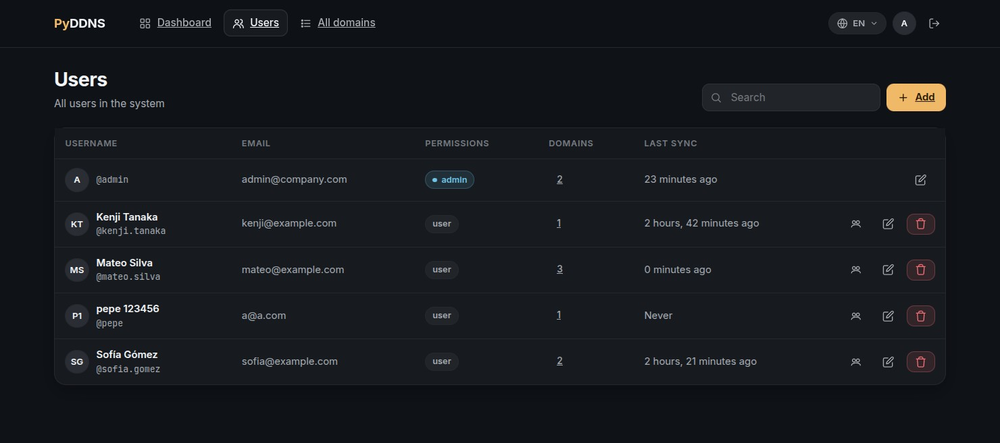

<div align="center">

# PyDDNS

**Self-hosted Dynamic DNS server. Run your own `dyndns2`-compatible service — no vendor lock-in, no rate limits, no monthly fees.**

[](https://github.com/olimpo88/PyDDNS/actions/workflows/test.yml)
[](https://www.gnu.org/licenses/agpl-3.0)
[](https://www.python.org)
[](https://www.djangoproject.com)
[](https://www.postgresql.org)
[](https://www.docker.com)

[Quick Start](#-quick-start) · [Features](#-features) · [Screenshots](#-screenshots) · [REST API](#-rest-api-optional) · [Roadmap](#-roadmap) · [Contributing](#-contributing)

</div>

---

## 🌟 Why PyDDNS?

Public Dynamic DNS providers come with caveats: rate limits, paid tiers, branded subdomains, and data you don't own. **PyDDNS** is the self-hosted, production-ready alternative — a complete DDNS solution wrapped in a clean web UI and one-command Docker deployment.

Point a delegated subdomain at your server, create user accounts, and let users update their public IP from any standard `dyndns2` client — router firmware, `ddclient`, `inadyn`, mobile apps. DNS lives in your own BIND zone, activity is fully audited, access is gated per-user, and a Token-authenticated REST API is one env-var away.

---

## 🖼 Screenshots

<div align="center">



*Dashboard — public IP, owned subdomains with 24h uptime sparklines, recent activity log with filters, and a ddclient/curl quickstart.*

<br/>



*Login — language picker exposed when no operator-level lock is set.*

<br/>



*Users — admin overview with per-user domain count and last-sync time.*

</div>

---

## ✨ Features

- 🔌 **`dyndns2` protocol compatible** — drop-in replacement for No-IP, DynDNS, Duck DNS for any existing client (`ddclient`, `inadyn`, router firmware)
- 🔑 **Token-authenticated REST API** (optional, opt-in) — full CRUD over users, subdomains, activity log, with per-token revocation
- 👥 **Multi-user, multi-domain** — admin panel, per-user subdomains, role-based permissions, soft-delete prevention for the current user
- 🎭 **Admin impersonation** — superusers can sign in as any active account (with a sticky banner and full audit trail) for support and debugging without needing the user's password
- 📧 **Password reset by email** (toggleable) — built-in self-service flow with localized email templates. Operators that prefer admin-controlled credentials can disable it with a single env var
- 🎨 **Modern dark UI** — responsive Django templates + Alpine.js, no SPA build pipeline. Amber accent palette, Inter for UI, JetBrains Mono for technical data
- 🌍 **8 languages out of the box** — 🇺🇸 English · 🇪🇸 Spanish · 🇧🇷 Portuguese (Brazilian) · 🇫🇷 French · 🇩🇪 German · 🇷🇺 Russian · 🇯🇵 Japanese · 🇨🇳 Chinese (Simplified). Browser auto-detection, in-app picker, or operator-locked mode
- 🔐 **Production-grade security** — Argon2id password hashing (PBKDF2 fallback), HSTS, secure cookies, CSP-friendly, hardened headers, env-driven secrets, brute-force throttle (per-IP and per-user), input validation
- 📊 **Full audit trail** — every IP update, login attempt, and admin action persisted to Postgres with timestamps, agent strings, and return codes
- 🛡 **Container hardening** — multi-stage build, non-root user, read-only root filesystem, dropped capabilities, no-new-privileges
- 🩺 **Healthchecks everywhere** — Postgres `pg_isready`, Gunicorn TCP probe, `depends_on: service_healthy` gates startup order
- 🧪 **Tested in CI** — pytest suite (88+ tests), GitHub Actions on every push with `pip-audit` for CVE scanning, `ruff` for lint
- 🔄 **Smooth upgrades** — scripted Postgres 9.6 → 15 migration runs both versions in parallel under a Compose profile
- 🧰 **One-command deployment** — `docker compose up -d` and you're live

---

## 🛠 Tech Stack

| Layer | Technology |
|-------|-----------|
| Backend | [Django 5.2 LTS](https://www.djangoproject.com) on [Python 3.11](https://www.python.org) |
| WSGI | [Gunicorn 23](https://gunicorn.org) — 3 workers in production, `--reload` in development |
| Frontend | Server-rendered Django templates + [Alpine.js](https://alpinejs.dev) for interactivity |
| Design tokens | Inter (UI), JetBrains Mono (data), oklch palette, dark mode by default |
| REST API | [Django REST framework](https://www.django-rest-framework.org) (optional, gated by `ENABLE_REST_API`) |
| DNS | [BIND](https://www.isc.org/bind/) via [`davd/docker-ddns`](https://hub.docker.com/r/davd/docker-ddns) |
| Database | [PostgreSQL 15](https://www.postgresql.org) |
| Reverse Proxy | [nginx 1.27](https://nginx.org) — TLS 1.2/1.3, modern ciphers, security headers |
| Orchestration | [Docker Compose v2](https://docs.docker.com/compose/) — multi-stage build, hardened runtime |
| Auth | Sessions for web UI, Token for REST API, HTTP Basic for `dyndns2` |
| Hashing | Argon2id (with `argon2-cffi`), PBKDF2 fallback |
| Testing | [pytest](https://pytest.org), [pytest-django](https://pytest-django.readthedocs.io), [pytest-env](https://pypi.org/project/pytest-env/), [ruff](https://docs.astral.sh/ruff/) |
| CI | [GitHub Actions](https://github.com/features/actions) — tests + lint + `pip-audit` on every push |

---

## 🚀 Quick Start

### Prerequisites

- [Docker](https://docs.docker.com/install/) and [Docker Compose v2](https://docs.docker.com/compose/install/)
- A delegated subdomain (e.g. `ddns.example.com`) pointing to your server's public IP
- Ports 53 (TCP/UDP), 80, and 443 reachable from the internet

> **Ubuntu 18+ users:** see [troubleshooting](#-troubleshooting) about freeing port 53 from `systemd-resolved`.

### Installation

```bash
git clone https://github.com/olimpo88/PyDDNS.git
cd PyDDNS

# 1. Configure environment
cp .env-demo .env

# 2. Generate a Django secret key — paste it into DJANGO_SECRET_KEY in .env
docker run --rm python:3.11-slim python -c "import secrets; print(secrets.token_urlsafe(50))"

# 3. Build and start the stack
docker compose build
docker compose up -d

# 4. Watch services become healthy
docker compose ps
```

All four services — `python`, `postgres`, `nginx`, `ddns` — should reach `(healthy)` within ~30 seconds. The web UI is on `HTTP_PORT` (80 by default); log in with `DJANGO_SU_NAME` / `DJANGO_SU_PASSWORD` defined in `.env`.

> **Picked up an env change?** `docker compose restart python` reloads code only. To pick up `.env` or `docker-compose.yml` edits use `docker compose up -d --force-recreate python`.

---

## 🔧 Configuration

Environment variables live in `.env` (template: [`.env-demo`](.env-demo)).

| Variable | Purpose | Required |
|----------|---------|:-:|
| `DOMAIN` | Delegated subdomain (e.g. `ddns.example.com`) | ✅ |
| `SHARED_SECRET` | Internal API token between Django and BIND | ✅ |
| `DJANGO_SECRET_KEY` | Cryptographic signing key (fail-loud if unset) | ✅ |
| `DJANGO_ALLOWED_HOSTS` | Comma-separated valid `Host` headers | ✅ |
| `DJANGO_SETTINGS_MODULE` | `pyddns.settings.production` or `.development` | ✅ |
| `DJANGO_LANGUAGE_CODE` | **Empty** = international mode (browser auto-detects, picker visible). **Set** (`es`, `fr`, `pt-br`, …) = locked: every page in that language, picker hidden | ➖ |
| `DJANGO_TIME_ZONE` | TZ database name (default `UTC`) | ➖ |
| `DATABASE_NAME` / `_USER` / `_PASS` | PostgreSQL connection | ✅ |
| `DJANGO_SU_NAME` / `_EMAIL` / `_PASSWORD` | Bootstrap admin user (created on first start) | ✅ |
| `DJANGO_ADMIN_URL` | Path of `/admin` (rename for security through obscurity) | ➖ |
| `DNS_ALLOW_AGENT` | Comma-separated User-Agent allowlist for `/nic/update` | ➖ |
| `ENABLE_REST_API` | Set to `1` to expose Token-authenticated `/api/` endpoints (off by default) | ➖ |
| `EMAIL_HOST` / `_PORT` / `_HOST_USER` / `_HOST_PASSWORD` | SMTP credentials. Empty `EMAIL_HOST` = log emails to stderr instead of sending (zero-config in dev) | ➖ |
| `EMAIL_USE_TLS` / `EMAIL_USE_SSL` | Enable STARTTLS or SSL on the SMTP socket (defaults: TLS on) | ➖ |
| `EMAIL_FROM` | `From:` header used by outgoing mail (default: `PyDDNS <noreply@<DNS_DOMAIN>>`) | ➖ |
| `SITE_URL` | Absolute base URL used by email templates for clickable links | ➖ |
| `ALLOW_PASSWORD_RESET` | `1` (default) = users can reset their own passwords via email. `0` = admin-only: reset URLs return 404 and the "Forgot your password?" link is hidden | ➖ |
| `COMPOSE_PROFILES` | Set to `migration` to run the Postgres 9.6 → 15 upgrade flow | ➖ |

### Development mode

```ini
DJANGO_DEBUG=1
DJANGO_SETTINGS_MODULE=pyddns.settings.development
```

Then `docker compose restart python` — Gunicorn picks up code changes automatically via `--reload`.

<details>
<summary><strong>DNS zone setup (NS delegation, glue records)</strong></summary>

You need a delegated subdomain. Create an **NS record** in your parent zone:

```
ddns.example.com IN NS X.X.X.X
```

Example BIND zone for delegation:

```
ddns.example.com.   IN  A   X.X.X.X
$ORIGIN ddns.example.com.
@                   IN  NS  ddns.example.com.
```

To edit the zone file directly (e.g. for static records):

```bash
docker compose exec ddns bash
rndc freeze ddns.example.com
# edit data/bind-data/ddns.example.com.zone
rndc thaw ddns.example.com
```
</details>

<details>
<summary><strong>SSL / HTTPS configuration</strong></summary>

The default nginx config exposes both HTTP (`HTTP_PORT`) and HTTPS (`HTTPS_PORT`) with TLS 1.2/1.3 only and modern ciphers.

For testing, generate a self-signed certificate:

```bash
mkdir -p data/certs/
openssl req -x509 -nodes -days 365 -newkey rsa:2048 \
  -keyout data/certs/https.key -out data/certs/https.crt
```

For production, drop your CA-issued `https.crt` and `https.key` into `data/certs/` (Let's Encrypt, Cloudflare Origin, your own CA, etc.).

In production settings, `SECURE_SSL_REDIRECT` forces HTTP → HTTPS, HSTS is set with a 1-year max-age, and CSRF cookies are `Secure` + `HttpOnly`.
</details>

---

## 🔌 REST API (optional)

Set `ENABLE_REST_API=1` in `.env` to expose a Token-authenticated JSON API under `/api/`. When disabled, neither DRF nor the `api` app are loaded — zero attack surface added.

```bash
# 1. Obtain a token
curl -X POST https://ddns.example.com/api/auth/token/ \
  -d "username=youruser&password=yourpass"
# {"token": "abc123..."}

# 2. List your subdomains
curl https://ddns.example.com/api/subdomains/ \
  -H "Authorization: Token abc123..."

# 3. Update a subdomain's IP
curl -X POST https://ddns.example.com/api/subdomains/1/update_ip/ \
  -H "Authorization: Token abc123..." \
  -H "Content-Type: application/json" \
  -d '{"ip": "203.0.113.42"}'

# 4. Revoke the token (logout)
curl -X POST https://ddns.example.com/api/auth/token/revoke/ \
  -H "Authorization: Token abc123..."
```

**Endpoints:**
- `POST /api/auth/token/` · `POST /api/auth/token/revoke/`
- `GET /api/me/`
- `GET POST /api/subdomains/` · `GET PUT DELETE /api/subdomains/{id}/`
- `POST /api/subdomains/{id}/update_ip/`
- `GET /api/activity/` (own log; admin sees all)
- `GET POST /api/users/` and `GET PUT DELETE /api/users/{id}/` (admin only)

The classic `/nic/update` (`dyndns2`) endpoint stays available regardless — `ddclient` and friends keep working.

---

## 📧 Email & password reset

PyDDNS ships with a self-service password-reset flow built on Django's signed tokens. Behaviour is controlled by two env vars:

- **`EMAIL_HOST`** — leave empty to log outgoing emails to stderr (handy in dev). Set to your SMTP host (Mailgun, SendGrid, your own postfix, etc.) to actually deliver. Set the related `EMAIL_PORT`, `EMAIL_HOST_USER`, `EMAIL_HOST_PASSWORD`, `EMAIL_USE_TLS`, `EMAIL_FROM` and `SITE_URL` accordingly.
- **`ALLOW_PASSWORD_RESET`** — `1` by default. Set to `0` for admin-controlled credentials: the reset URLs disappear (404) and the "Forgot your password?" link is hidden. Only superusers can change passwords via the Users admin in that mode.

Email templates (HTML + plain text) are localized in all 8 supported languages — a request from `/fr/` lands in French, `/ja/` in Japanese, etc.

```ini
# Example for Mailgun
EMAIL_HOST=smtp.mailgun.org
EMAIL_PORT=587
EMAIL_HOST_USER=postmaster@mg.example.com
EMAIL_HOST_PASSWORD=key-...
EMAIL_USE_TLS=1
EMAIL_FROM=PyDDNS <noreply@example.com>
SITE_URL=https://ddns.example.com
ALLOW_PASSWORD_RESET=1
```

> **Note**: changes to `.env` require `docker compose up -d --force-recreate python` to take effect — `restart` only reloads code.

---

## 🌐 Internationalization

PyDDNS ships with translations for **8 locales**:

🇺🇸 English · 🇪🇸 Spanish · 🇧🇷 Portuguese (BR) · 🇫🇷 French · 🇩🇪 German · 🇷🇺 Russian · 🇯🇵 Japanese · 🇨🇳 Chinese (Simplified)

The `DJANGO_LANGUAGE_CODE` env var controls behaviour:

- **Empty / unset** → *international mode*. `LocaleMiddleware` auto-detects from the browser's `Accept-Language`. Users can switch via the in-app picker (globe icon, top-right). EN is the fallback when nothing else matches.
- **Set** to a supported code (e.g. `es`, `fr`, `pt-br`, `ja`) → *locked mode*. Every page is served in that language and the picker is hidden — useful when you're deploying for a specific community and don't want the choice exposed. Regional variants (`es-es`, `pt-BR`, `fr-FR`) canonicalise automatically.

To add or refine a translation:

```bash
# Extract new strings (run from a container with gettext available)
docker compose exec python python manage.py makemessages --locale <code>
# Edit appdata/pyddns/locale/<code>/LC_MESSAGES/django.po
docker compose exec python python manage.py compilemessages
docker compose restart python
```

If your runtime image is read-only-hardened (default), use a one-off container with `gettext` installed instead. See `scripts/` for examples.

---

## 🖥 DDNS Clients

Any `dyndns2`-compatible client works.

### Linux / macOS — `ddclient`

```ini
protocol=dyndns2
use=web, web=checkip.dyndns.com, web-skip='IP Address'
server=ddns.example.com
ssl=yes
login=youruser
password='yourpassword'
yourdomain.ddns.example.com
```

### Windows

[DynDNS Simply Client](https://sourceforge.net/projects/dyndnssimplycl/) — free and lightweight.

### Routers

ASUS, MikroTik, OpenWrt, OPNsense, pfSense, and most consumer routers ship with `dyndns2` support. Use the *Custom DNS* option and point it at your PyDDNS instance.

---

## 💡 Use Cases

- 🏠 **Home server access** — expose your NAS, IP cameras, or self-hosted services without paying for a static IP
- 🧪 **Lab and staging environments** — give every developer a stable subdomain that follows their dev VPN
- 🏢 **SMB infrastructure** — internal DDNS for branch offices, ISP-rotated IPs, or remote-worker VPN endpoints
- 🌍 **Sovereign deployments** — sidestep public DDNS providers that block your country, ISP, or charge premium tiers
- 🔒 **Privacy-first setups** — keep IP rotation patterns out of third-party logs

---

## 🧪 Testing

The pytest suite covers models, views, the full `dyndns2` protocol path, REST API endpoints, settings hardening, and DNS update flows.

Running locally:

```bash
# Easiest: ephemeral container with dev deps already bundled
docker run --rm \
  --network=pyddns_old_red \
  -v $(pwd)/appdata/pyddns:/usr/src/app \
  -w /usr/src/app \
  -e DJANGO_SECRET_KEY=test \
  -e DB_HOST=postgres -e DB_NAME=pyddns -e DB_USER=pyddns -e DB_PASSWORD=$(grep DATABASE_PASS .env | cut -d= -f2) \
  python:3.11-slim \
  bash -c "pip install -q -r /usr/src/app/../docker/requirements-dev.txt 2>/dev/null && python -m pytest -v"
```

In CI: pushes and pull requests automatically run the full suite against PostgreSQL 15 via [`.github/workflows/test.yml`](.github/workflows/test.yml). The same workflow runs `ruff check` and `pip-audit --strict` to fail on known CVEs.

---

## 🔄 Migrating from Postgres 9.6

PyDDNS v3+ runs on PostgreSQL 15. If you're upgrading from a 9.6-based release, the included script handles a side-by-side `pg_dump` → `psql` migration with both versions running in parallel under a Compose profile:

```bash
./scripts/migrate-postgres.sh
```

The script preserves your old data directory in `data/dbdata-old/` until you confirm the new cluster works. Full details in the [`scripts/migrate-postgres.sh`](scripts/migrate-postgres.sh) header.

---

## 🤝 Contributing

Contributions are welcome — bug reports, translation updates, documentation polish, and pull requests alike.

1. **Fork** the repository and clone your fork.
2. **Create a branch**: `git checkout -b feat/your-feature`.
3. **Run tests locally** before pushing (see [Testing](#-testing)).
4. **Open a pull request** against `master`, describing the change and linking any related issues.

Please follow the existing code style: Django conventions for Python, `ruff` for linting, conventional commit messages where practical.

**Translation contributions** are especially valuable. The shipped translations for `ja`, `de`, `zh-hans`, `fr`, `pt-br`, and `ru` are technically correct but were not reviewed by native speakers — refinements from native speakers (formality, regional terminology) are very welcome.

---

## 🔒 Security

Found a vulnerability? Please follow the disclosure process in [`SECURITY.md`](SECURITY.md). Don't open a public GitHub issue.

---

## 📜 License

PyDDNS is licensed under the **GNU Affero General Public License v3.0 (AGPLv3)**. See [`LICENSE`](LICENSE) for the full text and the additional Section 7 attribution clause.

What this means in plain English:

- ✅ You can use, modify, and run PyDDNS commercially
- ✅ You can host it as a paid service for others
- ⚠️ If you modify it, including operating a modified version as a network service (SaaS), you must publish your modifications under the same license
- ⚠️ The in-app attribution footer linking to the original repository must remain visible in any derivative

---

## 🙏 Acknowledgments

PyDDNS builds on the excellent [`docker-ddns`](https://github.com/dprandzioch/docker-ddns) image by **dprandzioch**. PyDDNS adds the multi-tenant Django front-end, audit logging, web management UI, REST API, hardened container runtime, and an opinionated production deployment.

---

## 🛟 Troubleshooting

<details>
<summary><strong>Port 53 already in use (Ubuntu 18+, systemd-resolved)</strong></summary>

```bash
sudo lsof -i :53
```

If `systemd-resolve` is bound, edit `/etc/systemd/resolved.conf`:

```ini
[Resolve]
DNS=1.1.1.1
DNSStubListener=no
```

Then symlink the resolver and reboot:

```bash
sudo ln -sf /run/systemd/resolve/resolv.conf /etc/resolv.conf
sudo reboot
```
</details>

<details>
<summary><strong>Postgres 15 fails to start with "incompatible data directory"</strong></summary>

You're upgrading from Postgres 9.6 and haven't migrated yet. Run [`./scripts/migrate-postgres.sh`](#-migrating-from-postgres-96) before `docker compose up`.
</details>

<details>
<summary><strong>"DJANGO_SECRET_KEY environment variable is required"</strong></summary>

The app refuses to start without a secret key. Generate one and add it to `.env`:

```bash
docker run --rm python:3.11-slim python -c "import secrets; print(secrets.token_urlsafe(50))"
```
</details>

<details>
<summary><strong>The language picker doesn't appear / language won't change</strong></summary>

If `DJANGO_LANGUAGE_CODE` is set in your `.env`, the app is in *locked mode* and the picker is hidden by design. Empty the variable and recreate the container:

```bash
# Edit .env: set DJANGO_LANGUAGE_CODE=
docker compose up -d --force-recreate python
```

`docker compose restart` only reloads code — env changes need `--force-recreate`.
</details>

<details>
<summary><strong>403 / CSRF errors on POST after deploying behind a reverse proxy</strong></summary>

Django 5 requires `CSRF_TRUSTED_ORIGINS` for HTTPS POSTs from a proxy. The production settings derive it from `DJANGO_ALLOWED_HOSTS` automatically — make sure your hostname is listed there.
</details>

---

## 📬 Contact

**Leandro Peralta** — [LinkedIn](https://www.linkedin.com/in/peraltaleandro/) · [GitHub](https://github.com/olimpo88)

If PyDDNS is useful to you, ⭐ the repo — it's the cheapest way to support an open-source author.

---

<div align="center">
<sub>Keywords: dynamic DNS · self-hosted DDNS · dyndns2 server · ddclient server · BIND web UI · Django DDNS · Docker DDNS · no-ip alternative · duckdns alternative · AGPL DNS · REST API DDNS · Argon2 DDNS</sub>
</div>
